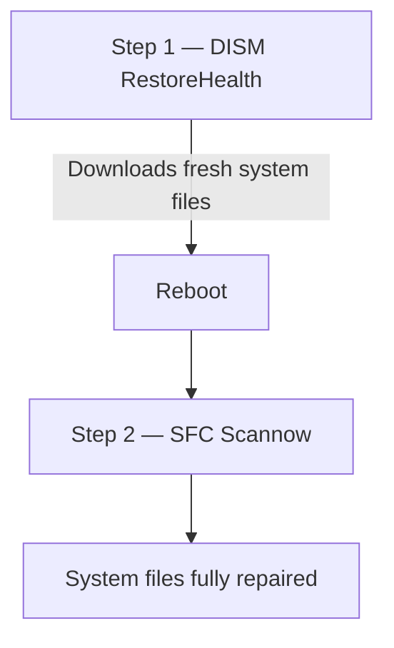

# Windows Repair & Diagnostics Toolkit

A consolidated reference for built-in Windows terminal tools that resolve system instability,
software corruption, storage errors, and resource issues — without third-party software.

> **Prerequisites:** Every command in this guide requires an **Elevated Command Prompt or
> PowerShell (Run as Administrator).**
>
> Quick launch: press **Win + R**, type `cmd`, then press **Ctrl + Shift + Enter**.

---

## Table of Contents

1. [Package & Software Updates (winget)](#1-package--software-updates-winget)
2. [System File & Image Repair (SFC & DISM)](#2-system-file--image-repair-sfc--dism)
3. [Storage & Disk Health (chkdsk)](#3-storage--disk-health-chkdsk)
4. [Hardware Diagnostics](#4-hardware-diagnostics)
5. [Process Management & Resource Recovery](#5-process-management--resource-recovery)
6. [AppX Package Management](#6-appx-package-management)
7. [Print Spooler Service Reset](#7-print-spooler-service-reset)
8. [Network Active Connection Audit](#8-network-active-connection-audit)
9. [Power & Battery Diagnostics](#9-power--battery-diagnostics)
10. [Automated Chained Repair](#10-automated-chained-repair)

---

## 1. Package & Software Updates (winget)

Outdated software is a leading cause of background crashes and security vulnerabilities.
`winget` updates your entire installed software ecosystem in a single command.

**Preview what will be updated:**

```cmd
winget upgrade
```

**Update everything silently (no wizard prompts):**

```cmd
winget upgrade --all --accept-package-agreements --accept-source-agreements
```

**Include packages winget tracks but doesn't manage by default:**

```cmd
winget upgrade --all --include-unknown
```

> `winget` is built into Windows 11. On fresh Windows 10 installs, update **Microsoft App
> Installer** from the Microsoft Store if the command returns an initialization error.

---

## 2. System File & Image Repair (SFC & DISM)

When Windows behaves erratically, this two-step sequence is the standard repair procedure.
Always run DISM **before** SFC — SFC relies on the local Component Store, which may itself
be corrupted. DISM fetches a clean copy from Microsoft's servers first.



### Step 1 — Repair the Component Store (DISM)

```cmd
dism /online /cleanup-image /restorehealth
```

- Connects to Windows Update servers to download and replace corrupted system image files.
- Requires an active internet connection.
- Takes 15–20 minutes.

### Step 2 — Reboot

Reboot before running SFC so the clean component files are loaded into memory.

### Step 3 — Scan and Replace Corrupted System Files (SFC)

```cmd
sfc /scannow
```

Uses the repaired Component Store to find and replace damaged Windows binaries.
The target result: _"Windows Resource Protection did not find any integrity violations."_

### Passive Diagnostics (Read-Only, No Changes)

```cmd
dism /online /cleanup-image /checkhealth   # Instant: reads internal corruption flags
dism /online /cleanup-image /scanhealth    # Deep: scans the image without applying fixes
```

### Automated Chained Variant

For unattended repair (e.g. walking away while it runs), chain all three with auto-reboot:

```powershell
dism /online /cleanup-image /restorehealth; sfc /scannow; shutdown /r /t 10
```

> The semicolons instruct PowerShell to wait for each stage to complete before starting
> the next. Save all open work before running this — the system restarts in 10 seconds
> after SFC finishes.

---

## 3. Storage & Disk Health (chkdsk)

### Quick Read-Only Assessment

```cmd
chkdsk
```

Analyzes the C: drive and reports file system health without making any changes.

### Deep Repair Scan

```cmd
chkdsk C: /r
```

- `/r` locates bad sectors, attempts data recovery from them, and applies logical file
  system fixes (`/f` is implied).
- Because the C: partition is in use while Windows runs, type `Y` when prompted to
  schedule the scan for the next reboot.

### Physical Drive Health (PowerShell)

```powershell
Get-PhysicalDisk | Format-Table FriendlyName, MediaType, HealthStatus, OperationalStatus
```

Reports the SSD/HDD health status as reported by the drive firmware.

---

## 4. Hardware Diagnostics

### Full System Hardware Profile

```powershell
Get-ComputerInfo
```

Returns OS version, BIOS firmware details, virtualization status, and raw hardware specs —
without installing third-party tools.

### RAM Diagnostic

If you experience random blue screens (BSODs) or app crashes that can't be explained by
software, the RAM may be physically faulty.

**Via Run dialog:**

1. Press **Win + R**, type `mdsched`, press **Enter**.
2. Select **Restart now and check for problems**.

The system reboots into a bare-metal memory test environment. If errors appear, the RAM
modules need to be replaced.

---

## 5. Process Management & Resource Recovery

When an application freezes the system and Task Manager itself fails to open, use the CLI
to identify and kill the offending process.

### Identify the Top 5 CPU Consumers

```powershell
Get-Process | Sort-Object CPU -Descending | Select-Object -First 5
```

### Kill a Process by Name

```powershell
Stop-Process -Name "msedge"
```

Replace `msedge` with the process name from the output above.

### List All Processes (CMD)

```cmd
tasklist
```

### Kill by PID or Name (CMD)

```cmd
taskkill /pid 1234 /f
taskkill /im chrome.exe /f
```

---

## 6. AppX Package Management

Some pre-installed Windows apps lack an "Uninstall" button in Settings. PowerShell can
remove them at the provisioning level.

### Find the Package Name

```powershell
Get-AppxPackage *store*
```

Replace `*store*` with any keyword to search. The `Name` field in the output is what you
need for the next step.

### Remove from Current User

```powershell
Get-AppxPackage -Name "Microsoft.WindowsStore" | Remove-AppxPackage
```

### Remove from All Users (and prevent re-provisioning)

```powershell
Get-AppxPackage -Name "Microsoft.WindowsStore" | Remove-AppxPackage -AllUsers
```

> Use `-AllUsers` with care — it removes the package from every account on the machine and
> prevents it from being reinstalled for new accounts automatically.

---

## 7. Print Spooler Service Reset

The Print Spooler service frequently stalls or traps corrupt print jobs. Restarting it
clears most printing issues without a full reboot.

### Standard Service Restart

```powershell
Restart-Service spooler
Get-Service spooler   # Confirm it's running
```

### Purge a Stuck Print Queue

If a corrupt job blocks the queue, restart alone won't help — you need to clear the cache:

```powershell
Stop-Service spooler
```

Navigate to `C:\Windows\System32\spool\PRINTERS` in File Explorer and delete all files
inside. Then:

```powershell
Start-Service spooler
```

---

## 8. Network Active Connection Audit

Useful for debugging connectivity issues or auditing which processes are communicating with
external servers.

### List Established Connections (PowerShell)

```powershell
Get-NetTCPConnection -State Established
```

Returns active outbound connections with local/remote addresses and the PID of each.

### Deep App-to-Port Mapping (CMD)

```cmd
netstat -nob
```

Maps each connection directly to the executable name (e.g. `msedge.exe`). More readable
than the PowerShell variant for security audits.

**Flags:**

- `-n` — numeric addresses (faster, no DNS resolution)
- `-o` — shows the PID per connection
- `-b` — shows the executable name per connection (requires elevation)

---

## 9. Power & Battery Diagnostics

For laptops with battery drain or sleep/wake issues.

### Energy Efficiency Report

```cmd
powercfg /energy
```

Monitors the system for 60 seconds, then generates an HTML report at
`C:\Windows\System32\energy-report.html`. Open that path in a browser to review devices
blocking sleep, sub-optimal power profiles, and USB wake events.

### Battery Health Report

```cmd
powercfg /batteryreport
```

Generates a full battery history report at `C:\Windows\System32\battery-report.html`.
Key metric: compare **Design Capacity** vs **Full Charge Capacity** to quantify battery
degradation over its charge cycle history.

---

## 10. Automated Chained Repair

For a fully automated repair + reboot that you can walk away from, paste this into an
elevated PowerShell window:

```powershell
dism /online /cleanup-image /restorehealth; sfc /scannow; shutdown /r /t 10
```

**Workflow:**

1. **DISM** downloads and restores the Component Store from Microsoft's servers.
2. **SFC** scans and replaces corrupted system files using the clean store.
3. **shutdown /r /t 10** restarts the machine 10 seconds after SFC completes.

> Save all open work before running. The 10-second window gives you time to review the
> terminal output before the machine reboots.
